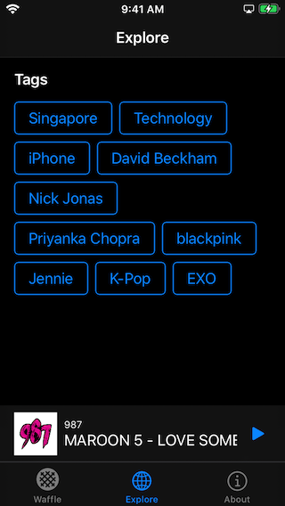
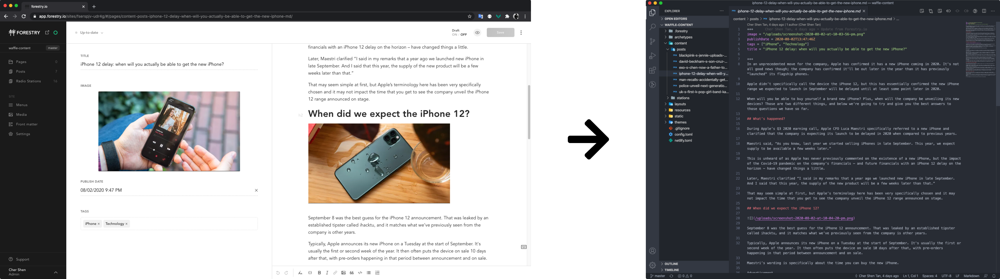
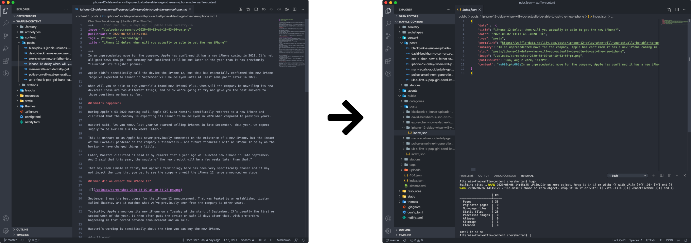
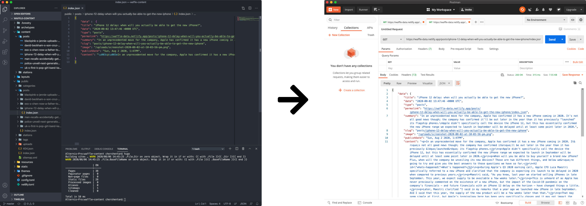
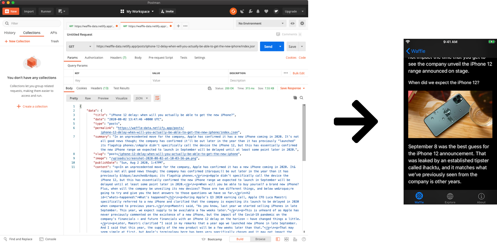
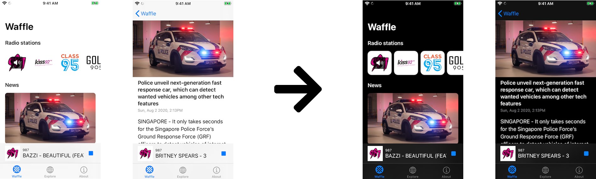
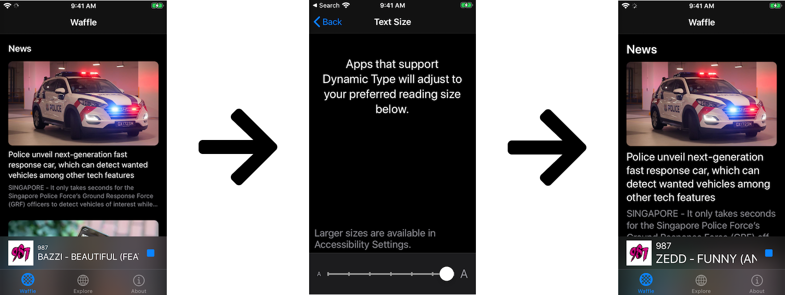

##### Disclaimer
All content featured on this app belong to their respective copyright holders. Content is used as a means for non-profit app development demonstration purposes. No copyright infringement intended.

# waffle
Waffle is a proof of concept JAMSTACK powered iOS app solution for delivering content.

 

### Its Tech Stack consists of the following:

#### CMS: Forestry.io
Forestry is a static CMS that allows content editors to create content that will be published in markdown format into a git repository

#### Static Site Generator: HUGO
HUGO is a static site generator that is able to consume markdown content to generate websites. In Waffle's case, I have configured HUGO to generate headless JSON feeds for the mobile app to consume.

#### Site hosting: Netlify
The Netlify platform provides a full solution to deploy and host sites easily. In Waffle's case, its netlify project has been configured to listen to changes in the content git repository. On any content publish, Netlify will run HUGO to generate the JSON feeds. These JSON feeds will then be deployed to Netlify's Content Delivery Network, ready to be consumed by the mobile app

#### Waffle iOS app
This app is built with iOS 13 SDK.

Built using the new UICollectionViewCompositionalLayout API that simplifies building multi-section collection view layouts.

Built using the new Swift Combine framework for reactive programming to enable UI components to listen to state changes over time and display the correct information.

UI Layouts built using programmatic UIKit with Auto Layout, System fonts and System colours to support Dark mode and Dynamic Type font sizing.

AVPlayer for radio station stream playback.

WKWebView for rendering posts' content
